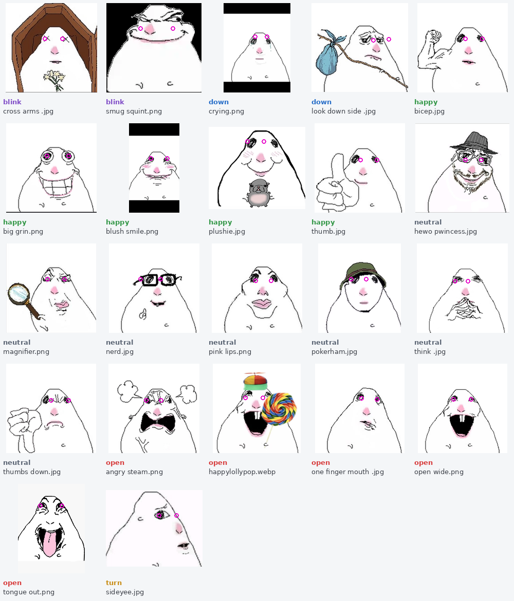

# nowplaying-pi

A small desk gadget built on a Raspberry Pi with a 2-inch screen. It:

- **shows what's playing on Spotify** — album-art colours, song, artist and a wavy progress bar;
- **turns into a photo slideshow** with a clock and the weather when the music stops;
- **works as a photo booth** using a USB webcam — with optional cartoon hamster
  stickers that sit on each face and change with your expression;
- **records timelapses** and turns them into short videos;
- **uploads photos and videos to Google Drive** automatically (optional).

Everything is controlled with three push buttons.



---

## Contents

1. [How it works, in plain terms](#how-it-works-in-plain-terms)
2. [What you need](#what-you-need)
3. [Wiring](#wiring)
4. [Installing](#installing)
5. [Accounts and keys (`.env`)](#accounts-and-keys-env)
6. [Using it](#using-it)
7. [Customising](#customising)
8. [Updating and everyday commands](#updating-and-everyday-commands)
9. [Running the tests](#running-the-tests)
10. [Troubleshooting](#troubleshooting)
11. [Further reading](#further-reading)

---

## How it works, in plain terms

The whole thing is one Python program, `nowplaying.py`, that runs in a loop on
the Pi. Every moment it asks "which mode am I in?" and draws one frame on the
screen:

| Mode | What you see | How you get there |
|---|---|---|
| **Now playing** | album colours, title, artist, progress bar | the default |
| **Slideshow** | your photos fading into each other, plus clock, date and weather | music paused for 10 seconds |
| **Photo booth** | a live camera view; press a button for a 3-2-1 photo | hold the middle button for 3 seconds |
| **Timelapse** | a progress screen with a red "recording" dot | in photo booth, hold the right button for 3 seconds |

Some terms you'll see below:

- **Spotify Web API** — Spotify's official way for programs to ask "what's
  playing?" and to press play/pause/skip. You need a free developer "app" so
  the program is allowed to ask.
- **OAuth / client ID and secret** — the sign-in system Spotify and Google use.
  The *client ID* names your app; the *client secret* is like a password for
  it. After you sign in once, a *token* is saved on the Pi so it stays signed in.
- **SPI** and **GPIO** — the Pi's pins. The screen talks over SPI (a fast data
  connection); the buttons are wired to GPIO pins (simple on/off inputs).
- **venv (virtual environment)** — a private folder of Python packages just for
  this program, so it doesn't clash with the rest of the system.
- **MediaPipe** — Google's face-tracking library. It finds 478 points on each
  face plus 52 "expression" scores (smile, mouth open, eyes shut…). The
  hamster filter uses these.
- **systemd service** — Linux's way of starting a program automatically at boot
  and restarting it if it crashes.

**The hamster filter**: for up to four faces, it works out a mood — mouth
open, smiling, eyes shut, head turned, looking down, or neutral — and places a
hamster sticker from that mood's pool, lined up on your eyes. Stickers are
picked at random, avoiding the last few used.

**Timelapses** take one frame every 4 seconds for up to 30 minutes (450
frames), then `ffmpeg` turns them into a ~15-second video. The video quality is
chosen so the file stays under 5 MB, the most the program's simple Drive
upload can send in one go.

---

## What you need

| Part | Notes |
|---|---|
| **Raspberry Pi 5** | Any memory size. A **Pi 4** also works for everything *except* the hamster filter (MediaPipe needs a CPU feature the Pi 4 lacks) — install with `--no-hamster`. |
| **Waveshare 2inch LCD Module** | ST7789V chip, 320×240 pixels, SPI. |
| **USB webcam** | Built with a Logitech C270; most UVC webcams should work. |
| **3 push buttons** | Momentary "tactile" buttons. Each connects a GPIO pin to ground — no resistors needed. |
| **microSD card** | 16 GB or more. |
| Accounts | A free Spotify account (Premium is needed for the play/skip buttons — that's a Spotify rule). Optionally a Google account for Drive upload. |

---

## Wiring

Full diagram: **[docs/wiring.png](docs/wiring.png)** (same on Pi 4 and Pi 5).
"Pin" means the physical pin number on the Pi's 40-pin header. Pin 1 has a
square solder pad and sits at the end furthest from the USB ports; odd pins
are on the inner row, even pins on the outer edge.

| Display | Pi pin | | Buttons | Pi pin |
|---|---|---|---|---|
| VCC | 17 (3.3 V) | | left | 29 (GPIO 5) |
| GND | 20 | | middle | 31 (GPIO 6) |
| DIN | 19 (GPIO 10, MOSI) | | right | 37 (GPIO 26) |
| CLK | 23 (GPIO 11, SCLK) | | other leg of every button | 39 (ground) |
| CS | 24 (GPIO 8, CE0) | | | |
| DC | 22 (GPIO 25) | | | |
| RST | 13 (GPIO 27) | | | |
| BL | 12 (GPIO 18) | | | |

The colours of the wires on the display's cable vary between batches — go by
the labels printed on the board, not the colours.

---

## Installing

### 1. Prepare the SD card

Use **Raspberry Pi Imager** to flash **Raspberry Pi OS Lite (64-bit)** (Debian
13 "trixie"; it's under "Raspberry Pi OS (other)"). In Imager's settings, set:

- a hostname (these docs assume `nowplaying`, so it's reachable as `nowplaying.local`),
- a username and password,
- your wifi,
- **Enable SSH**.

### 2. Download and set up the program

Connect from your computer with `ssh YOUR_USER@nowplaying.local`, then run:

```bash
sudo apt update && sudo apt install -y git
git clone https://github.com/Andr3wGFX/nowplaying-pi-public.git ~/np
bash ~/np/setup.sh
```

> **The folder must be `~/np`.** The program finds all its files under
> `~/np/…`, and `setup.sh` refuses to run from anywhere else.

`setup.sh` installs system packages, switches on SPI, creates the venv,
installs the Python packages, downloads the face model, and creates
`~/np/.env` for your keys. It's safe to run again. If it says SPI was just
enabled, run `sudo reboot` before continuing.

On a Pi 4, or if you don't want the hamster filter: `bash ~/np/setup.sh --no-hamster`.

### 3. Add your keys

`nano ~/np/.env` — see [the next section](#accounts-and-keys-env) for where each value comes from.

### 4. Sign in to Spotify (once)

```bash
~/np/bin/python ~/np/nowplaying.py
```

It prints a link. Open it on any device and approve. Your browser then shows
a **"can't reach this site"** page at `127.0.0.1:8080/callback?code=…` —
**that's expected**. Copy the full address from the address bar, paste it into
the terminal, and press Enter. The sign-in is saved, so it won't ask again.
Press Ctrl-C to stop the program.

### 5. Sign in to Google Drive (optional)

```bash
~/np/bin/python ~/np/gdrive_auth.py
```

It shows a short code to type in at google.com/device. Uploads go into a new
Drive folder called **Pi Photo Booth**.

### 6. Start automatically at boot

```bash
bash ~/np/install_service.sh
```

This fills your username into `nowplaying.service`, installs it, and starts it.

---

## Accounts and keys (`.env`)

The template is [`.env.example`](.env.example); `setup.sh` copies it to
`~/np/.env` and makes it readable only by you. **Never commit the filled-in
`.env`** — it holds client secrets, which work like passwords. `.gitignore`
already blocks it, along with the saved sign-in tokens.

| Setting | Where it comes from |
|---|---|
| `SPOTIPY_CLIENT_ID`, `SPOTIPY_CLIENT_SECRET` | [developer.spotify.com/dashboard](https://developer.spotify.com/dashboard) → *Create app*. Add the redirect URI `http://127.0.0.1:8080/callback` **exactly** (Spotify no longer accepts `localhost`). Copy the client ID and secret from the app's settings. The play/pause/skip buttons need Spotify **Premium**. |
| `SPOTIPY_REDIRECT_URI` | Leave as `http://127.0.0.1:8080/callback`. |
| `GOOGLE_CLIENT_ID`, `GOOGLE_CLIENT_SECRET` | Optional — see below. Leave blank to keep photos on the Pi only. |
| `NP_TIMEZONE` | Your time zone as an [IANA name](https://en.wikipedia.org/wiki/List_of_tz_database_time_zones), e.g. `Europe/London`. Blank = the Pi's own setting. |
| `NP_LAT`, `NP_LON` | Rough latitude/longitude for the weather (town-level is fine). Blank = no weather. Weather comes from [Open-Meteo](https://open-meteo.com), which needs no key. |

**Setting up Google Drive upload** (in the [Google Cloud console](https://console.cloud.google.com)):

1. Create a project and enable the **Google Drive API**.
2. Set up the **OAuth consent screen** with only the **`drive.file`** scope.
   That scope lets the app see *only the files it created itself* — nothing
   else in your Drive.
3. Create an **OAuth client** of type **"TVs and Limited Input devices"** and
   copy its ID and secret into `.env`.
4. **Publish the consent screen to "In production".** If you leave it in
   *Testing*, Google signs the Pi out every 7 days. Production asks for a home
   page and privacy policy URL; fill-in-the-blanks templates are in
   [`docs/oauth-pages/`](docs/oauth-pages/) — replace `YOUR_EMAIL_HERE` and
   host them anywhere (e.g. GitHub Pages).

---

## Using it

Three buttons: **left** (GPIO 5), **middle** (GPIO 6), **right** (GPIO 26).

| | Now playing | Slideshow | Photo booth | During a timelapse |
|---|---|---|---|---|
| **Left** | previous track | previous photo | hamster filter on/off | hamster filter on/off |
| **Middle** press | play / pause | play / pause | back to now playing | stop and save → photo booth |
| **Middle** hold 3 s | photo booth | photo booth | — | — |
| **Right** press | next track | next photo | 3-2-1, take a photo | — |
| **Right** hold 3 s | — | — | start a timelapse | — |

The middle and right buttons act when you **let go**, so holding one never
also triggers a press.

Photos are saved in `~/np/captures/`, timelapses in `~/np/timelapse/`.

---

## Customising

### Slideshow photos

Details in [photos/README.md](photos/README.md). In short, copy your pictures
to the Pi (e.g. into `~/originals`), then:

```bash
~/np/bin/python ~/np/convert_photos.py ~/originals ~/np/photos
```

This resizes and crops them to fit the screen.

### Hamster stickers

Stickers live in `stickers/`, listed in `stickers/stickers.json`. Each entry
has:

- the **file name**,
- the **pixel position of the hamster's two eyes** — this is how the sticker
  is lined up with your eyes,
- **`expr`**, the mood it's used for: `open`, `happy`, `blink`, `turn`, `down`
  or `neutral`.

To add one: put the image in `stickers/`, open it in any image editor that
shows pixel coordinates, note the centre of each eye, and add an entry. Every
mood needs at least one sticker; three or more avoids repeats.

To check your eye coordinates, run `~/np/bin/python ~/np/tools/sticker_sheet.py`.
It redraws `docs/stickers.png` (the picture at the top of this page) with a
pink ring on every eye position, so a misplaced one stands out.

### Fonts

Optional — see [fonts/README.md](fonts/README.md). Without a custom font it
uses Quicksand, which `setup.sh` installs.

### Tuning the face filter

The expression thresholds at the top of `hamster.py` were measured on one
person's face with one webcam. If the filter guesses your expression wrong,
use these tools to measure your own (run each with
`~/np/bin/python ~/np/tools/NAME.py`, after stopping the service):

| Tool | What it tells you |
|---|---|
| `tools/checkmp.py` | camera + face model sanity check; shows the expressions and frame rate |
| `tools/recal.py` | measures *your* neutral / smile / open-mouth / eyes-shut scores — set the thresholds from these |
| `tools/livestate.py` | a live trace of scores and mood changes — for "it flickers" or "it's slow to switch" |
| `tools/headcheck.py` | head turn and nod angles, and whether the nod direction is right for your camera |
| `tools/cameracheck.py` | display speed and camera frame rate |
| `tools/checkupload.py` | why didn't a photo upload? Checks each step, then tries a real upload (safe while the service runs) |

---

## Updating and everyday commands

Update to the latest version:

```bash
cd ~/np && git pull && sudo systemctl restart nowplaying
```

If `requirements.txt` or `requirements-mediapipe.txt` changed, run
`bash ~/np/setup.sh` again — it never touches your `.env`, tokens, photos or
captures.

```bash
sudo systemctl stop nowplaying       # stop it (do this before running anything by hand)
sudo systemctl start nowplaying      # start it again
journalctl -u nowplaying -f          # watch its output live (Ctrl-C to quit watching)
~/np/bin/python ~/np/uploadnow.py ~/np/timelapse/*.mp4   # upload videos recorded while offline
sudo shutdown -h now                 # always do this before unplugging the power
```

Only one program can use the camera and the screen at a time, so **stop the
service before running anything else that uses them**.

---

## Running the tests

```bash
bash tests/run_all.sh
```

The tests run on any computer with Python 3, Pillow, NumPy, OpenCV and
requests — no Pi, screen, camera, internet or Spotify account needed. The
screen, buttons, Spotify and MediaPipe are replaced by fakes (`tests/stubs/`,
`tests/stubs_mp/`); the fake screen keeps real pixels so tests can check what
was actually drawn. Each test uses a throwaway home folder
(`tests/_sandbox.py`), so it can never touch your real sign-ins.

There are two kinds: **pass/fail** tests (`testmp`, `testgeom`, `testhead`,
`testtimelapse`, `testtlflow`) and **print-only** tests (the rest), which only
fail on a crash — read their output to judge them.

---

## Troubleshooting

- **Screen lights up but stays blank, no error.** The `st7789` 1.0.1 driver
  holds the screen in reset. The program works around it by calling `reset()`
  then `_init()`; do the same in any test script of your own.
- **`OSError [Errno 16] Device or resource busy`** — something else is using
  the pins, usually the service. `sudo systemctl stop nowplaying`.
- **Hamsters vanished or camera acting strange after a `pip install`.** Run
  `~/np/bin/python -c "import cv2; print(cv2.__version__)"`. If it says 5.x, a
  pip copy of OpenCV replaced the system one — re-run `setup.sh`.
- **`nowplaying.local` not found** (common on Windows): run `hostname -I` on
  the Pi and use the IP address instead.
- **`REMOTE HOST IDENTIFICATION HAS CHANGED`** after reinstalling the SD card:
  expected. On your computer run `ssh-keygen -R nowplaying.local` (and the same
  with the IP address).
- **Wifi changes disappear after a reboot.** On Pi OS trixie, the network set
  in Imager is regenerated at every boot, so edits to it are lost. Add networks
  as *new* connections instead (`sudo nmtui` → Add, or
  `nmcli dev wifi connect …`); those are kept. Use `autoconnect-priority` to
  choose which network wins.
- **A timelapse didn't upload.** Uploads are capped at 5 MB and the encoder
  aims for 4 MB. Videos recorded offline upload with `uploadnow.py`, and the
  program also retries on its next start.
- **Clock is an hour out.** Set `NP_TIMEZONE` to your exact IANA zone. Some
  regions don't use daylight saving, so a generic zone is wrong half the year.

---

## Further reading

- [`docs/build-notes-pi4.md`](docs/build-notes-pi4.md) — the original Pi 4 build and the bugs that cost the most time.
- [`docs/build-notes-pi5.md`](docs/build-notes-pi5.md) — the Pi 5 build: face-filter measurements, how expressions are decided, and every bug with its cause.
- [`docs/design-history.md`](docs/design-history.md) — **start here if you're curious:** the story of the build, why it moved from a Pi 4 to a Pi 5, and the reasoning behind each design choice.
- [`NOTICE.md`](NOTICE.md) — credits, third-party licences and image rights.

## Licence

The code is [MIT licensed](LICENSE): use it, change it, share it, just keep the
copyright notice. **The sticker images and `background.png` are not covered** —
they're meme art the author doesn't own. Swap in your own if you reuse this
project (see [NOTICE.md](NOTICE.md)).
